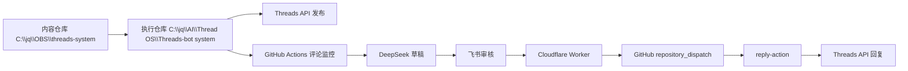
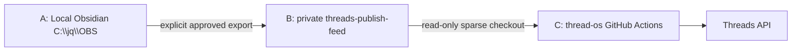

# 架构概览

## 系统分层

## 责任划分

- 内容仓库: 存放可发布素材、待审草稿、人工整理内容
- 执行仓库: 存放自动化代码、状态文件、测试和运行文档
- 回复任务状态文件: `state/reply_tasks.json`
- Threads API: 执行发布和回复动作
- GitHub Actions: 定时监控与任务调度
- 飞书: 人工审核入口
- Cloudflare Worker: 飞书回调桥接

## 设计约束

- 发布和回复必须分开看
- 人工确认不能被自动化跳过
- 任何状态变更都要有记录
- 任何外部平台契约都要先写清楚再实现

## 需要长期保留的状态概念

- `post_id`
- `comment_id`
- `reply_id`
- `status`
- `last_error`

## Current MVP boundary

- JSON is the current runtime state backend for local validation and the temporary GitHub Actions bridge.
- Publish tasks use `ready`, `publishing`, `published`, `failed`, and `unknown` states.
- Reply tasks remain semi-automatic: DeepSeek drafts, Feishu reviews, and a human action triggers dispatch.
- `unknown` means the external result was not confirmed and is never automatically retried.
- Reply monitor and dispatch share a concurrency group and commit JSON state as MVP persistence.
- State Worker/D1 is separate from the Feishu Callback Worker and is not the current runtime backend.

## Current three-repository boundary

- A is the only source of truth for complete content and the current editable version.
- B contains only approved Markdown snapshots under `posts/queue/<content_id>.md`.
- C never checks out or reads A. `source_ref` is traceability metadata, not a path C may follow.
- B never stores `ready/publishing/published/failed/unknown` runtime state.
- C stores publish state in `state/publish_tasks.json` and reply state in `state/reply_tasks.json` for the current MVP.
- All workflows that write those JSON files use `thread-os-state-write` concurrency.
- State API/D1 migration is deferred and is not part of this publishing-feed integration.
