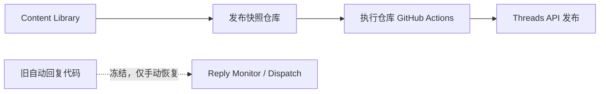

# 架构概览

## 系统分层

## 责任划分

- Content Library: 正式内容事实源，存放可发布内容、选题、评论、回复资产和发布回执
- 发布快照仓库: 只保存从 Content Library 导出的 approved / scheduled 发布快照
- 执行仓库: 存放自动化代码、状态文件、测试和运行文档
- 回复任务状态文件: `state/reply_tasks.json`
- Threads API: 执行发布和回复动作
- GitHub Actions: 发布编排；回复相关 workflow 当前仅手动触发
- 飞书与 Cloudflare Worker: 旧自动回复入口保留但不主动运行

## 设计约束

- 发布和回复必须分开看
- 人工确认不能被自动化跳过
- 任何状态变更都要有记录
- 任何外部平台契约都要先写清楚再实现

## 需要长期保留的状态概念

- `post_id`
- `comment_id`
- `reply_id`
- `status`
- `last_error`

## Current MVP boundary

- JSON is the current runtime state backend for local validation and the temporary GitHub Actions bridge.
- Publish tasks use `ready`, `publishing`, `published`, `failed`, and `unknown` states.
- Reply tasks remain semi-automatic: DeepSeek drafts, Feishu reviews, and a human action triggers dispatch.
- `unknown` means the external result was not confirmed and is never automatically retried.
- Reply monitor and dispatch share a concurrency group and commit JSON state as MVP persistence.
- State Worker/D1 is separate from the Feishu Callback Worker and is not the current runtime backend.
